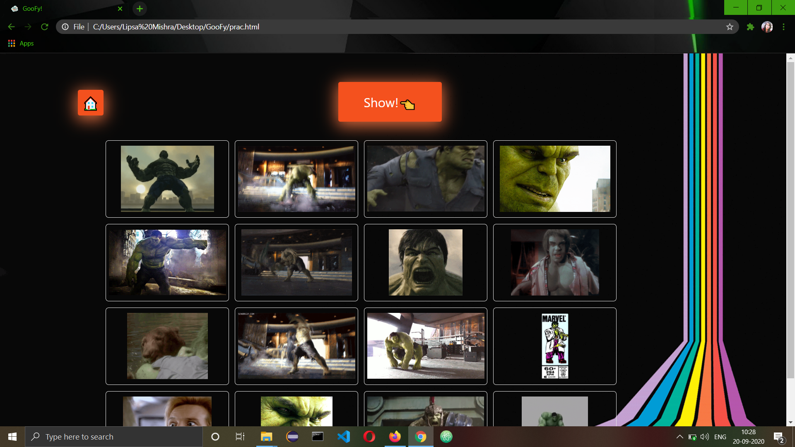

# GooFy
### A website that make sure you find all your favourite gifs.🍕
## Screenshots.
#### First Page

#### Second Page

### Instructions
1) Clone this repo to your local machine.
2) Create an account on giphy from https://giphy.com/ 
3) Get an API key from https://developers.giphy.com/dashboard/ and replace it with GIPHY_KEY in app.js file.

### Requirement
Compatible with Google Chrome.
